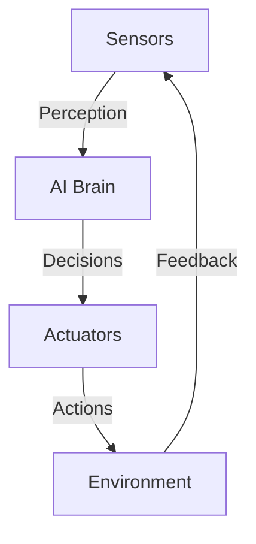

# Introduction to Physical AI & Humanoid Robotics

:::note Learning Objectives
- Understand the convergence of AI and robotics in physical embodiments
- Identify key components of humanoid robotic systems
- Recognize the role of ROS 2 in modern robotics development
:::

## What is Physical AI?

Physical AI represents the integration of artificial intelligence with embodied systems—robots that interact with the physical world. Unlike traditional AI that operates purely in digital domains (e.g., language models, image classifiers), Physical AI must handle:

- **Sensor Uncertainty**: Real-world measurements are noisy and incomplete
- **Actuator Constraints**: Motors have limits on torque, speed, and precision
- **Environmental Dynamics**: Physics governs motion, requiring real-time control

Humanoid robots are a quintessential example: they must perceive their surroundings (vision, touch, IMU), reason about actions (planning, decision-making), and execute coordinated movements (inverse kinematics, balance control).

## Why ROS 2?

The Robot Operating System 2 (ROS 2) provides a middleware framework for building complex robotic applications. Unlike ROS 1, ROS 2 offers:

- **Real-Time Capable**: DDS (Data Distribution Service) middleware supports deterministic communication
- **Multi-Robot Support**: Built-in discovery and QoS (Quality of Service) for robot swarms
- **Security**: DDS-Security for encrypted, authenticated messages
- **Cross-Platform**: Linux, Windows, macOS support

ROS 2 Humble Hawksbill (LTS release, supported until 2027) is the target platform for this textbook. All code examples are tested on Ubuntu 22.04 LTS.

## Course Roadmap

This textbook adopts a hands-on approach: each chapter includes mathematical foundations, ROS 2 implementations, and practice problems.

## Further Reading

- ROS 2 Design Document: https://design.ros2.org/
- Thrun, S., Burgard, W., & Fox, D. (2005). *Probabilistic Robotics*. MIT Press.
- Murphy, R. R. (2019). *Introduction to AI Robotics*. MIT Press.

## Check Your Understanding

:::note Question 1
What is the main difference between traditional AI and Physical AI?
A) Physical AI operates in digital domains only
B) Physical AI must handle sensor uncertainty and actuator constraints in the physical world
C) Traditional AI is more advanced than Physical AI
D) There is no difference between them
**Answer**: B
:::

:::note Question 2
What does ROS 2 provide that makes it suitable for multi-robot systems?
A) Only supports single robot operations
B) Built-in discovery and Quality of Service (QoS) for robot swarms
C) It is faster than traditional programming languages
D) It requires special hardware
**Answer**: B
:::

:::note Question 3
What does DDS stand for in the context of ROS 2?
A) Data Distribution System
B) Data Distribution Service
C) Distributed Development System
D) Dynamic Data Structure
**Answer**: B
:::

:::note Question 4
What is the LTS release of ROS 2 mentioned in the text?
A) ROS 2 Foxy
B) ROS 2 Humble Hawksbill
C) ROS 2 Galactic
D) ROS 2 Rolling
**Answer**: B
:::

:::note Question 5
What operating system is recommended for running the examples in this textbook?
A) Windows 10
B) macOS
C) Ubuntu 22.04 LTS
D) Any Linux distribution
**Answer**: C
:::