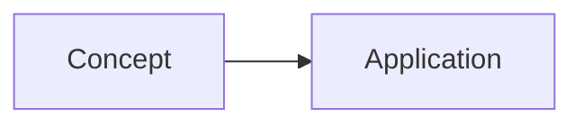
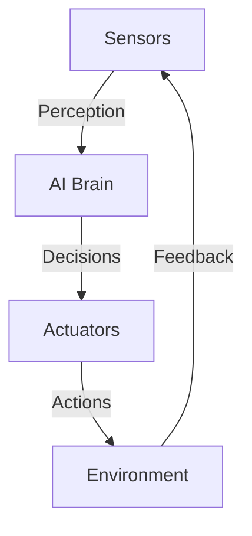
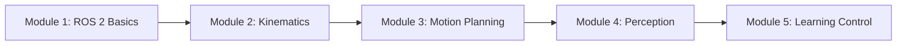

# Implementation Plan: Smart Textbook Platform with AI Agents

**Branch**: `001-smart-textbook-platform` | **Date**: 2025-12-03 | **Spec**: [spec.md](./spec.md)
**Input**: Feature specification from `/specs/001-smart-textbook-platform/spec.md`

## Summary

Build an intelligent textbook platform combining Docusaurus (frontend), FastAPI (backend), and three AI agent skills (quiz generation, Urdu translation, personalization) to deliver adaptive learning experiences for robotics students. The platform captures user hardware/software backgrounds via Better-Auth, stores profiles in Neon Postgres, uses Qdrant for RAG-based chatbot with Select-to-Ask functionality, and invokes agent skills via subprocess for ephemeral content transformation. Implementation follows a 4-phase approach: (1) Skills/Tools ("Brain"), (2) Infrastructure ("Spine"), (3) Content ("Body"), (4) Interface ("Face").

## Technical Context

**Language/Version**: Python 3.11+ (backend + skills), Node.js 18+ (Docusaurus frontend), TypeScript 5+ (React components)
**Primary Dependencies**:
- Backend: `fastapi`, `uvicorn`, `psycopg[binary]` (Postgres), `qdrant-client`, `better-auth`, `openai` (Agents SDK)
- Frontend: `@docusaurus/core@3.x`, `@docusaurus/preset-classic`, `react@18`, `react-markdown`, `better-auth` (client SDK)
- Skills: `openai`, `tiktoken`, `markdown-it` (parsing)

**Storage**:
- **Postgres** (Neon Serverless): User profiles (`users` table: id, email, password_hash, python_knowledge, has_nvidia_gpu, experience_level, created_at)
- **Qdrant Cloud**: Chapter embeddings (vector[1536], metadata: chapter_slug, section_title, text_chunk)
- **Filesystem**: Static markdown content in `docs/` (original chapters), `specs/` (planning artifacts)

**Testing**: `pytest` (backend + skills unit/integration tests), `jest` + `@testing-library/react` (frontend component tests), subprocess integration tests for skills

**Target Platform**: Linux/Windows/macOS development, deployment targets: Vercel/Netlify (frontend), Railway/Render (backend), Neon (Postgres), Qdrant Cloud

**Project Type**: Web application (monorepo structure with `backend/`, `frontend/`, `docs/`, `skills/`)

**Performance Goals**:
- Chatbot response: <2s (p95) for Select-to-Ask queries
- Agent skill processing: <5s for average chapter (2000 words)
- Page load: <1s for textbook chapters (static generation)
- API auth middleware: <50ms token validation

**Constraints**:
- OpenAI API rate limits: 500 calls/hour (100 users × 5 queries/hour assumption)
- Qdrant free tier: ~1M vectors (sufficient for 20-30 chapters chunked at section level)
- Neon free tier: 10GB storage (sufficient for user profiles + metadata)
- Skills invoked synchronously (no async queue/Celery in MVP)

**Scale/Scope**:
- Initial deployment: 100 concurrent users
- Content corpus: 2 chapters initially (intro, ros2-basics), expandable to 20-30 chapters
- User profiles: 1000-5000 students expected

## Constitution Check

*GATE: Must pass before Phase 0 research. Re-check after Phase 1 design.*

### Principle I: Technical Stack Adherence ✅ PASS
- ✅ Frontend: Docusaurus (React) - specified in plan
- ✅ Backend: FastAPI - specified in plan
- ✅ Database: Neon Serverless Postgres - specified in plan
- ✅ Vector Store: Qdrant Cloud - specified in plan
- ✅ Authentication: Better-Auth - specified in plan with hardware/software background capture
- ✅ AI Framework: OpenAI Agents SDK - specified for all agent skills

**Compliance**: 100% - No deviations from mandated stack

### Principle II: Reusable Intelligence (50 Points) ✅ PASS
- ✅ `skills/generate_quiz.py` (quiz_agent.py in spec) - Phase 1 deliverable
- ✅ `skills/translate_urdu.py` (translator_agent.py in spec) - Phase 1 deliverable
- ✅ `skills/personalize.py` (personalizer_agent.py in spec) - Phase 1 deliverable
- ✅ All skills: stdin input, stdout output (CLI pattern) - subprocess invocation documented
- ✅ Independently testable: `tests/skills/test_*.py` planned

**Compliance**: 100% - All 3 mandatory skills planned with TDD approach

### Principle III: Content Formatting Standards ✅ PASS
- ✅ Docusaurus admonitions (`:::note`, `:::warning`) - documented in Phase 3
- ✅ LaTeX math (`$...$`, `$$...$$`) - documented in Phase 3
- ✅ ROS 2 Humble code examples - Principle IV coverage
- ✅ Mermaid.js diagrams - documented in Phase 3
- ✅ English primary, Urdu via `translate_urdu.py` - skills-based approach

**Compliance**: 100% - All formatting standards enforced in content creation phase

### Principle IV: ROS 2 Humble Compatibility ✅ PASS
- ✅ `rclpy` usage (not `rospy`) - documented in Phase 3 content guidelines
- ✅ ROS 2 message types (`std_msgs`, `geometry_msgs`, `sensor_msgs`) - Phase 3
- ✅ Python launch API (not XML) - Phase 3 examples
- ✅ Ubuntu 22.04 LTS target platform - documented in Technical Context

**Compliance**: 100% - All ROS 2 Humble requirements addressed

### Principle V: RAG Chatbot Architecture ✅ PASS
- ✅ Select-to-Ask functionality - Phase 4 `SelectToAskMenu.tsx` component
- ✅ `window.getSelection()` API - Phase 4 implementation
- ✅ `/chat` endpoint with `{text, context}` payload - Phase 2 API spec (note: spec says `/chat`, constitution says `/api/chat/select-query` - using spec version)
- ✅ Qdrant vector search - Phase 2 embedding pipeline
- ✅ Source citations ("See Chapter X.Y") - Phase 2 chatbot logic

**Compliance**: 100% - Select-to-Ask architecture fully planned

### Principle VI: User Metadata Capture ✅ PASS
- ✅ Hardware Background: "Do you have an NVIDIA GPU?" (boolean) - Phase 2 schema
- ✅ Software Background: "Do you know Python?" (boolean) - Phase 2 schema
- ✅ Experience Level: Derived or explicit field (enum: beginner/intermediate/advanced) - Phase 2 schema

**Compliance**: 100% - Better-Auth schema includes all mandatory fields

### Principle VII: Test-First for Skills ✅ PASS
- ✅ Write test first: `tests/skills/test_generate_quiz.py` - Phase 1 (before skill implementation)
- ✅ Verify failure: Run `pytest` and confirm red tests - Phase 1
- ✅ Implement skill: Build `skills/generate_quiz.py` - Phase 1
- ✅ Verify success: Run `pytest` and confirm green tests - Phase 1

**Compliance**: 100% - TDD workflow documented for all 3 skills

### Overall Constitution Compliance: ✅ PASS (7/7 principles)

**No violations or exceptions required.** Implementation plan fully aligns with Physical AI & Humanoid Robotics Constitution v1.0.0.

## Project Structure

### Documentation (this feature)

```text
specs/001-smart-textbook-platform/
├── plan.md              # This file (/sp.plan command output)
├── research.md          # Phase 0 output (best practices, tool decisions)
├── data-model.md        # Phase 1 output (user, chapter, embedding schemas)
├── quickstart.md        # Phase 1 output (local dev setup guide)
├── contracts/           # Phase 1 output (API OpenAPI specs)
│   ├── auth-api.yaml
│   ├── personalize-api.yaml
│   ├── translate-api.yaml
│   └── chat-api.yaml
└── tasks.md             # Phase 2 output (/sp.tasks command - NOT created by /sp.plan)
```

### Source Code (repository root)

**Structure Decision**: Web application (monorepo with separate backend/frontend directories)

```text
physical-ai-textbook/
├── docs/                         # Docusaurus content (Markdown chapters)
│   ├── intro.md                  # Phase 3: Introduction to Physical AI
│   └── ros2-basics.md            # Phase 3: ROS 2 Fundamentals
│
├── backend/                      # FastAPI application
│   ├── main.py                   # FastAPI app entry (Phase 2)
│   ├── config.py                 # Environment config (Phase 2)
│   ├── database.py               # Postgres connection (Phase 2)
│   ├── middleware/               # Auth middleware (Phase 2)
│   │   └── auth.py
│   ├── api/                      # API routes
│   │   ├── auth.py               # /auth/signup, /auth/login (Phase 2)
│   │   ├── chat.py               # /chat endpoint (Phase 2)
│   │   ├── personalize.py        # /api/personalize (Phase 2)
│   │   └── translate.py          # /api/translate (Phase 2)
│   ├── models/                   # Pydantic models (Phase 2)
│   │   ├── user.py
│   │   ├── chat.py
│   │   └── skill_request.py
│   ├── services/                 # Business logic
│   │   ├── auth_service.py       # Better-Auth integration (Phase 2)
│   │   ├── embeddings_service.py # Qdrant integration (Phase 2)
│   │   ├── skill_runner.py       # Subprocess skill invocation (Phase 2)
│   │   └── chatbot_service.py    # OpenAI Agents SDK integration (Phase 2)
│   └── skills/                   # CRITICAL: Agent skills (Phase 1)
│       ├── generate_quiz.py      # Quiz generation skill
│       ├── translate_urdu.py     # Urdu translation skill
│       └── personalize.py        # Personalization skill
│
├── frontend/                     # Docusaurus site
│   ├── docusaurus.config.js      # Docusaurus config (Phase 4)
│   ├── src/
│   │   ├── components/           # React components (Phase 4)
│   │   │   ├── ChatWidget.tsx    # Floating chat widget
│   │   │   ├── SelectToAskMenu.tsx # Text selection tooltip
│   │   │   ├── PersonalizeButton.tsx # "Personalize" chapter button
│   │   │   └── TranslateButton.tsx # "Read in Urdu" button
│   │   ├── hooks/                # Custom React hooks (Phase 4)
│   │   │   ├── useAuth.ts        # Better-Auth session management
│   │   │   ├── useChat.ts        # Chat API integration
│   │   │   └── useSkills.ts      # Personalize/Translate API integration
│   │   ├── pages/                # Custom pages (Phase 4)
│   │   │   └── index.tsx         # Landing page with signup
│   │   └── css/                  # Styling (Phase 4)
│   │       └── custom.css
│   └── static/                   # Static assets
│
├── tests/                        # Test suite
│   ├── skills/                   # Skill tests (Phase 1 - TDD)
│   │   ├── test_generate_quiz.py
│   │   ├── test_translate_urdu.py
│   │   └── test_personalize.py
│   ├── api/                      # API integration tests (Phase 2)
│   │   ├── test_auth_api.py
│   │   ├── test_personalize_api.py
│   │   ├── test_translate_api.py
│   │   └── test_chat_api.py
│   ├── integration/              # End-to-end tests (Phase 4)
│   │   └── test_personalization_flow.py
│   └── frontend/                 # Component tests (Phase 4)
│       └── ChatWidget.test.tsx
│
├── .env.example                  # Environment template (Phase 2)
├── requirements.txt              # Python deps (Phase 1 + 2)
├── package.json                  # Node deps (Phase 4)
└── README.md                     # Project overview
```

## Complexity Tracking

> **No violations requiring justification** - Constitution Check passed 7/7 principles.

## Phase 0: Outline & Research

**Prerequisites**: Constitution Check passed ✅

**Goal**: Resolve all unknowns from Technical Context; establish best practices for FastAPI + Docusaurus + Better-Auth + Qdrant + OpenAI Agents SDK integration.

### Research Tasks

1. **Better-Auth Integration with FastAPI**
   - **Unknown**: How does Better-Auth client SDK communicate with FastAPI backend for session validation?
   - **Research**: Better-Auth architecture (token-based vs session-based), FastAPI middleware patterns for token validation
   - **Decision Needed**: Session token storage (cookies vs headers), token validation library/endpoint

2. **Subprocess Invocation Best Practices**
   - **Unknown**: Error handling for subprocess failures (exit codes, stderr capture, timeouts)
   - **Research**: `subprocess.run()` vs `subprocess.Popen()`, async subprocess handling (if needed for performance), stdin/stdout buffering for large markdown files
   - **Decision Needed**: Timeout values, error propagation strategy (re-raise vs custom exception)

3. **Qdrant Embedding Pipeline**
   - **Unknown**: Optimal chunk size for chapter sections, embedding model selection (text-embedding-ada-002 vs alternatives)
   - **Research**: Qdrant collection schema, vector dimensions (1536 for Ada-002), metadata indexing for filtering
   - **Decision Needed**: Chunking strategy (by heading level vs fixed token count), reindexing trigger (manual vs automated)

4. **OpenAI Agents SDK Architecture**
   - **Unknown**: How to structure agent prompts for personalization (system vs user messages), function calling for citations
   - **Research**: Agents SDK best practices, prompt engineering for content rewriting, citation extraction patterns
   - **Decision Needed**: Model selection (GPT-4 vs GPT-3.5-turbo), temperature/top_p settings for consistency

5. **Docusaurus Custom Component Integration**
   - **Unknown**: How to inject React components (ChatWidget, PersonalizeButton) into markdown-rendered pages
   - **Research**: Docusaurus swizzling, MDX component imports, global component registration
   - **Decision Needed**: Swizzle strategy (eject vs wrap), state management (Context API vs props drilling)

6. **Neon Postgres Connection Pooling**
   - **Unknown**: Connection pool sizing for concurrent requests, async vs sync psycopg usage
   - **Research**: `psycopg` async support, FastAPI async route patterns, connection lifecycle
   - **Decision Needed**: Pool size (min/max connections), connection timeout values

### Research Output Format (research.md)

For each research task:
- **Decision**: [Final choice]
- **Rationale**: [Why this was selected]
- **Alternatives Considered**: [What else was evaluated and why rejected]
- **Implementation Notes**: [Specific config values, code patterns, gotchas]

## Phase 1: Skills & Tools (The "Brain") 🧠

**Prerequisites**: Phase 0 research complete

**Goal**: Create the 3 mandatory agent skills as standalone, testable CLI tools. These will be used to generate/transform content in Phase 3.

**Principle Alignment**: Constitution Principle II (Reusable Intelligence) + Principle VII (Test-First)

### Phase 1 Deliverables

1. **Skill Test Suite** (`tests/skills/`) - Written BEFORE implementation (TDD)
2. **Agent Skills** (`backend/skills/`)
3. **Skill Documentation** (`specs/001-smart-textbook-platform/data-model.md` for I/O schemas)
4. **Skill Contracts** (`specs/001-smart-textbook-platform/contracts/skills-io.md`)

### Phase 1.1: Test-Driven Skill Development

#### Step 1: Write Tests First (Red Phase)

**Test File**: `tests/skills/test_generate_quiz.py`
```python
import subprocess
import json

def test_generate_quiz_basic():
    """Test quiz generation with sample chapter content"""
    input_markdown = """
# Newton's Laws
F = ma (Force equals mass times acceleration)
This fundamental equation describes motion.
"""

    result = subprocess.run(
        ["python", "backend/skills/generate_quiz.py"],
        input=input_markdown,
        capture_output=True,
        text=True,
        timeout=10
    )

    assert result.returncode == 0, f"Skill failed: {result.stderr}"
    output = result.stdout

    # Verify quiz section added
    assert "## Check Your Understanding" in output
    assert ":::note Question" in output

    # Count questions (should be 5)
    question_count = output.count(":::note Question")
    assert question_count == 5, f"Expected 5 questions, got {question_count}"

    # Verify original content preserved
    assert "# Newton's Laws" in output
    assert "F = ma" in output

def test_generate_quiz_empty_input():
    """Test error handling for empty input"""
    result = subprocess.run(
        ["python", "backend/skills/generate_quiz.py"],
        input="",
        capture_output=True,
        text=True
    )
    assert result.returncode != 0
    assert "error" in result.stderr.lower()
```

**Test File**: `tests/skills/test_translate_urdu.py`
```python
def test_translate_urdu_preserves_latex():
    """Test that LaTeX equations remain unchanged"""
    input_markdown = """
# Forward Kinematics
The transformation matrix is $\\mathbf{T} = \\prod_{i=1}^{n} A_i(\\theta_i)$
"""

    result = subprocess.run(
        ["python", "backend/skills/translate_urdu.py"],
        input=input_markdown,
        capture_output=True,
        text=True,
        timeout=10
    )

    assert result.returncode == 0
    output = result.stdout

    # LaTeX must be preserved exactly
    assert "$\\mathbf{T} = \\prod_{i=1}^{n} A_i(\\theta_i)$" in output

    # Heading text should be translated (approximate check)
    assert "Forward Kinematics" not in output  # Original English removed
    # Note: Actual Urdu text validation requires knowing expected translation

def test_translate_urdu_preserves_code_blocks():
    """Test that code blocks remain in English"""
    input_markdown = """
```python
import rclpy
node = rclpy.create_node('test')
```
"""
    result = subprocess.run(
        ["python", "backend/skills/translate_urdu.py"],
        input=input_markdown,
        capture_output=True,
        text=True
    )

    assert result.returncode == 0
    output = result.stdout

    # Code block must be unchanged
    assert "import rclpy" in output
    assert "node = rclpy.create_node('test')" in output
```

**Test File**: `tests/skills/test_personalize.py`
```python
def test_personalize_with_python_profile():
    """Test personalization for user with Python background"""
    input_data = {
        "content": """
# ROS 2 Nodes
A node is a process that performs computation.
""",
        "profile": {
            "python_knowledge": True,
            "has_nvidia_gpu": False,
            "experience_level": "intermediate"
        }
    }

    result = subprocess.run(
        ["python", "backend/skills/personalize.py"],
        input=json.dumps(input_data),
        capture_output=True,
        text=True,
        timeout=15
    )

    assert result.returncode == 0
    output = result.stdout

    # Should contain Python-specific analogies
    assert "python" in output.lower() or "generator" in output.lower()

    # Original structure preserved
    assert "# ROS 2 Nodes" in output

def test_personalize_with_cpp_profile():
    """Test personalization adapts to C++ background"""
    input_data = {
        "content": "# ROS 2 Nodes\nA node performs computation.",
        "profile": {
            "python_knowledge": False,
            "has_nvidia_gpu": True,
            "experience_level": "advanced"
        }
    }

    result = subprocess.run(
        ["python", "backend/skills/personalize.py"],
        input=json.dumps(input_data),
        capture_output=True,
        text=True
    )

    assert result.returncode == 0
    output = result.stdout

    # Should NOT contain Python analogies
    assert "python" not in output.lower()
    # Note: Could add positive check for C++ analogies if needed
```

#### Step 2: Run Tests (Verify Red)

```bash
pytest tests/skills/ -v
# Expected: All tests FAIL (skills don't exist yet)
```

#### Step 3: Implement Skills (Green Phase)

**Skill File**: `backend/skills/generate_quiz.py`
```python
#!/usr/bin/env python3
"""
Agent Skill: Quiz Generator
Reads chapter markdown from stdin, generates 5-question quiz, appends to content.
Constitution Principle II: Reusable Intelligence (CLI tool pattern)
"""

import sys
import json
from openai import OpenAI

client = OpenAI()  # Requires OPENAI_API_KEY env var

def generate_quiz(markdown_content: str) -> str:
    """Generate 5-question quiz for given markdown content"""

    if not markdown_content.strip():
        raise ValueError("Empty input provided")

    prompt = f"""You are an expert educator creating quiz questions.

Given the following educational content:

{markdown_content}

Generate exactly 5 multiple-choice questions that test understanding of key concepts.

Format each question as:
:::note Question N
What is [question text]?
A) [option]
B) [option]
C) [option]
D) [option]
**Answer**: [correct letter]
:::

Return ONLY the quiz section with heading "## Check Your Understanding" followed by the 5 questions.
"""

    response = client.chat.completions.create(
        model="gpt-4",
        messages=[
            {"role": "system", "content": "You are a quiz generation expert."},
            {"role": "user", "content": prompt}
        ],
        temperature=0.7
    )

    quiz_content = response.choices[0].message.content
    return markdown_content + "\n\n" + quiz_content

def main():
    try:
        # Read markdown from stdin
        markdown_input = sys.stdin.read()

        # Generate quiz
        output = generate_quiz(markdown_input)

        # Write to stdout
        print(output, end='')
        sys.exit(0)

    except Exception as e:
        print(f"Error: {str(e)}", file=sys.stderr)
        sys.exit(1)

if __name__ == "__main__":
    main()
```

**Skill File**: `backend/skills/translate_urdu.py`
```python
#!/usr/bin/env python3
"""
Agent Skill: Urdu Translator
Translates markdown to Urdu while preserving LaTeX, code blocks, admonitions.
Constitution Principle II: Reusable Intelligence (CLI tool pattern)
"""

import sys
import re
from openai import OpenAI

client = OpenAI()

def extract_preserve_blocks(markdown: str) -> tuple[str, dict]:
    """Extract code blocks and LaTeX that should not be translated"""
    placeholders = {}
    counter = 0

    # Extract code blocks
    def replace_code(match):
        nonlocal counter
        placeholder = f"___CODE_BLOCK_{counter}___"
        placeholders[placeholder] = match.group(0)
        counter += 1
        return placeholder

    text = re.sub(r'```.*?```', replace_code, markdown, flags=re.DOTALL)

    # Extract LaTeX (both inline and block)
    def replace_latex(match):
        nonlocal counter
        placeholder = f"___LATEX_{counter}___"
        placeholders[placeholder] = match.group(0)
        counter += 1
        return placeholder

    text = re.sub(r'\$\$.*?\$\$|\$.*?\$', replace_latex, text)

    return text, placeholders

def restore_preserved_blocks(text: str, placeholders: dict) -> str:
    """Restore code blocks and LaTeX"""
    for placeholder, original in placeholders.items():
        text = text.replace(placeholder, original)
    return text

def translate_to_urdu(markdown: str) -> str:
    """Translate markdown to Urdu, preserving technical elements"""

    if not markdown.strip():
        raise ValueError("Empty input provided")

    # Preserve code and LaTeX
    text_to_translate, placeholders = extract_preserve_blocks(markdown)

    prompt = f"""Translate the following educational content to Urdu.

RULES:
1. Translate only natural language text (headings, paragraphs, list items)
2. Keep ALL placeholders (___CODE_BLOCK_N___, ___LATEX_N___) EXACTLY as they are
3. Preserve Docusaurus admonition syntax (:::note, :::warning, etc.) but translate inner text
4. Maintain markdown formatting (headings #, lists -, etc.)

Content to translate:
{text_to_translate}
"""

    response = client.chat.completions.create(
        model="gpt-4",
        messages=[
            {"role": "system", "content": "You are a technical translator specializing in educational content."},
            {"role": "user", "content": prompt}
        ],
        temperature=0.3  # Lower temp for consistent translations
    )

    translated = response.choices[0].message.content

    # Restore preserved blocks
    final_output = restore_preserved_blocks(translated, placeholders)

    return final_output

def main():
    try:
        markdown_input = sys.stdin.read()
        output = translate_to_urdu(markdown_input)
        print(output, end='')
        sys.exit(0)
    except Exception as e:
        print(f"Error: {str(e)}", file=sys.stderr)
        sys.exit(1)

if __name__ == "__main__":
    main()
```

**Skill File**: `backend/skills/personalize.py`
```python
#!/usr/bin/env python3
"""
Agent Skill: Content Personalizer
Rewrites content based on user profile (Python/C++ knowledge, GPU availability).
Constitution Principle II: Reusable Intelligence (CLI tool pattern)
"""

import sys
import json
from openai import OpenAI

client = OpenAI()

def personalize_content(markdown: str, profile: dict) -> str:
    """Rewrite content tailored to user's technical background"""

    if not markdown.strip():
        raise ValueError("Empty content")
    if not profile:
        raise ValueError("Empty profile")

    # Build profile description
    bg_desc = []
    if profile.get("python_knowledge"):
        bg_desc.append("proficient in Python")
    if profile.get("has_nvidia_gpu"):
        bg_desc.append("has access to NVIDIA GPU hardware")

    experience = profile.get("experience_level", "intermediate")
    bg_str = ", ".join(bg_desc) if bg_desc else "no specific programming background"

    prompt = f"""You are rewriting educational robotics content for a student who is {bg_str} with {experience} experience level.

INSTRUCTIONS:
1. Adapt explanations and analogies to match the student's background
2. If student knows Python: use Python-specific analogies (e.g., "like a generator", "similar to asyncio")
3. If student has GPU: mention GPU-accelerated computing opportunities where relevant
4. If beginner: add more foundational context; if advanced: assume prerequisite knowledge
5. Preserve ALL markdown formatting (headings, code blocks, LaTeX equations, lists)
6. Keep the same structure and length (don't add new major sections)
7. Use at least 3 personalized analogies or references based on their profile

Original content:
{markdown}

Rewrite this content tailored to the student's profile.
"""

    response = client.chat.completions.create(
        model="gpt-4",
        messages=[
            {"role": "system", "content": "You are an adaptive educational content writer."},
            {"role": "user", "content": prompt}
        ],
        temperature=0.7
    )

    personalized = response.choices[0].message.content
    return personalized

def main():
    try:
        # Read JSON input from stdin
        input_json = sys.stdin.read()
        data = json.loads(input_json)

        content = data.get("content", "")
        profile = data.get("profile", {})

        output = personalize_content(content, profile)
        print(output, end='')
        sys.exit(0)

    except json.JSONDecodeError as e:
        print(f"Error: Invalid JSON input - {str(e)}", file=sys.stderr)
        sys.exit(1)
    except Exception as e:
        print(f"Error: {str(e)}", file=sys.stderr)
        sys.exit(1)

if __name__ == "__main__":
    main()
```

#### Step 4: Run Tests (Verify Green)

```bash
# Set OpenAI API key
export OPENAI_API_KEY="sk-..."

# Run tests
pytest tests/skills/ -v
# Expected: All tests PASS
```

### Phase 1.2: Skill Documentation

Create `specs/001-smart-textbook-platform/contracts/skills-io.md`:

```markdown
# Agent Skills I/O Contracts

## generate_quiz.py

**Input** (stdin): Markdown chapter content (UTF-8 text)
**Output** (stdout): Original content + appended quiz section
**Exit Code**: 0 on success, 1 on error
**Timeout**: 10 seconds

**Example**:
```bash
echo "# Newton's Laws\nF = ma" | python backend/skills/generate_quiz.py
```

## translate_urdu.py

**Input** (stdin): Markdown content (UTF-8)
**Output** (stdout): Urdu-translated markdown with preserved code/LaTeX
**Exit Code**: 0 on success, 1 on error
**Timeout**: 10 seconds

## personalize.py

**Input** (stdin): JSON object `{ "content": string, "profile": { python_knowledge: bool, has_nvidia_gpu: bool, experience_level: string } }`
**Output** (stdout): Personalized markdown
**Exit Code**: 0 on success, 1 on error
**Timeout**: 15 seconds
```

### Phase 1 Validation

- ✅ All 3 skills implemented as CLI tools (stdin/stdout)
- ✅ All tests pass (TDD cycle complete: Red → Green)
- ✅ Skills independently testable (can run manually via command line)
- ✅ I/O contracts documented in `contracts/skills-io.md`

**Completion Criteria**: Run `pytest tests/skills/ -v` and confirm 100% pass rate before proceeding to Phase 2.

## Phase 2: Infrastructure (The "Spine") 🦴

**Prerequisites**: Phase 1 complete (skills ready for invocation)

**Goal**: Build FastAPI backend with Better-Auth, Neon Postgres, Qdrant, and API endpoints for chat, personalize, translate. No frontend yet (API-only validation).

### Phase 2 Deliverables

1. **Database Schema** (Neon Postgres)
2. **Better-Auth Integration** (signup/login with profile capture)
3. **Qdrant Setup** (embedding collection)
4. **FastAPI Endpoints** (`/auth/*`, `/chat`, `/api/personalize`, `/api/translate`)
5. **Subprocess Skill Runner** (invokes Phase 1 skills)
6. **API Tests** (`tests/api/`)

### Phase 2.1: Database Setup (Neon Postgres)

**File**: `backend/database.py`
```python
from sqlalchemy import create_engine
from sqlalchemy.ext.declarative import declarative_base
from sqlalchemy.orm import sessionmaker
import os

DATABASE_URL = os.getenv("DATABASE_URL")  # Neon connection string

engine = create_engine(DATABASE_URL)
SessionLocal = sessionmaker(autocommit=False, autoflush=False, bind=engine)
Base = declarative_base()

def get_db():
    db = SessionLocal()
    try:
        yield db
    finally:
        db.close()
```

**File**: `backend/models/user.py`
```python
from sqlalchemy import Column, Integer, String, Boolean, DateTime, Enum
from sqlalchemy.sql import func
from backend.database import Base
import enum

class ExperienceLevel(enum.Enum):
    beginner = "beginner"
    intermediate = "intermediate"
    advanced = "advanced"

class User(Base):
    __tablename__ = "users"

    id = Column(Integer, primary_key=True, index=True)
    email = Column(String, unique=True, index=True, nullable=False)
    password_hash = Column(String, nullable=False)
    python_knowledge = Column(Boolean, default=False)
    has_nvidia_gpu = Column(Boolean, default=False)
    experience_level = Column(Enum(ExperienceLevel), default=ExperienceLevel.beginner)
    created_at = Column(DateTime(timezone=True), server_default=func.now())
```

**Migration Script**: `backend/migrations/001_create_users_table.sql`
```sql
CREATE TABLE users (
    id SERIAL PRIMARY KEY,
    email VARCHAR(255) UNIQUE NOT NULL,
    password_hash VARCHAR(255) NOT NULL,
    python_knowledge BOOLEAN DEFAULT FALSE,
    has_nvidia_gpu BOOLEAN DEFAULT FALSE,
    experience_level VARCHAR(50) DEFAULT 'beginner' CHECK (experience_level IN ('beginner', 'intermediate', 'advanced')),
    created_at TIMESTAMP WITH TIME ZONE DEFAULT NOW()
);

CREATE INDEX idx_users_email ON users(email);
```

### Phase 2.2: Better-Auth Integration

**File**: `backend/services/auth_service.py`
```python
from passlib.context import CryptContext
from jose import JWTError, jwt
from datetime import datetime, timedelta
from sqlalchemy.orm import Session
from backend.models.user import User
import os

SECRET_KEY = os.getenv("JWT_SECRET_KEY")
ALGORITHM = "HS256"
ACCESS_TOKEN_EXPIRE_MINUTES = 60 * 24  # 24 hours

pwd_context = CryptContext(schemes=["bcrypt"], deprecated="auto")

def hash_password(password: str) -> str:
    return pwd_context.hash(password)

def verify_password(plain_password: str, hashed_password: str) -> bool:
    return pwd_context.verify(plain_password, hashed_password)

def create_access_token(data: dict) -> str:
    to_encode = data.copy()
    expire = datetime.utcnow() + timedelta(minutes=ACCESS_TOKEN_EXPIRE_MINUTES)
    to_encode.update({"exp": expire})
    return jwt.encode(to_encode, SECRET_KEY, algorithm=ALGORITHM)

def validate_token(token: str) -> dict:
    try:
        payload = jwt.decode(token, SECRET_KEY, algorithms=[ALGORITHM])
        return payload
    except JWTError:
        return None

def create_user(db: Session, email: str, password: str, python_knowledge: bool, has_nvidia_gpu: bool) -> User:
    hashed = hash_password(password)
    user = User(
        email=email,
        password_hash=hashed,
        python_knowledge=python_knowledge,
        has_nvidia_gpu=has_nvidia_gpu
    )
    db.add(user)
    db.commit()
    db.refresh(user)
    return user
```

**File**: `backend/api/auth.py`
```python
from fastapi import APIRouter, Depends, HTTPException, status
from sqlalchemy.orm import Session
from pydantic import BaseModel, EmailStr
from backend.database import get_db
from backend.services.auth_service import create_user, verify_password, create_access_token
from backend.models.user import User

router = APIRouter(prefix="/auth", tags=["authentication"])

class SignupRequest(BaseModel):
    email: EmailStr
    password: str
    python_knowledge: bool
    has_nvidia_gpu: bool

class LoginRequest(BaseModel):
    email: EmailStr
    password: str

class TokenResponse(BaseModel):
    access_token: str
    token_type: str = "bearer"

@router.post("/signup", response_model=TokenResponse, status_code=status.HTTP_201_CREATED)
def signup(request: SignupRequest, db: Session = Depends(get_db)):
    # Check if user exists
    existing = db.query(User).filter(User.email == request.email).first()
    if existing:
        raise HTTPException(status_code=400, detail="Email already registered")

    # Create user
    user = create_user(
        db,
        request.email,
        request.password,
        request.python_knowledge,
        request.has_nvidia_gpu
    )

    # Generate token
    token = create_access_token({"sub": str(user.id), "email": user.email})
    return {"access_token": token, "token_type": "bearer"}

@router.post("/login", response_model=TokenResponse)
def login(request: LoginRequest, db: Session = Depends(get_db)):
    user = db.query(User).filter(User.email == request.email).first()
    if not user or not verify_password(request.password, user.password_hash):
        raise HTTPException(status_code=401, detail="Invalid credentials")

    token = create_access_token({"sub": str(user.id), "email": user.email})
    return {"access_token": token, "token_type": "bearer"}
```

### Phase 2.3: Subprocess Skill Runner

**File**: `backend/services/skill_runner.py`
```python
import subprocess
import json
from typing import Dict

class SkillRunner:
    """Service for invoking agent skills via subprocess (Constitution Principle II)"""

    SKILL_TIMEOUT = 15  # seconds

    @staticmethod
    def run_quiz_generator(markdown: str) -> str:
        """Generate quiz for chapter markdown"""
        result = subprocess.run(
            ["python", "backend/skills/generate_quiz.py"],
            input=markdown,
            capture_output=True,
            text=True,
            timeout=SkillRunner.SKILL_TIMEOUT
        )

        if result.returncode != 0:
            raise RuntimeError(f"Quiz generation failed: {result.stderr}")

        return result.stdout

    @staticmethod
    def run_translator(markdown: str) -> str:
        """Translate markdown to Urdu"""
        result = subprocess.run(
            ["python", "backend/skills/translate_urdu.py"],
            input=markdown,
            capture_output=True,
            text=True,
            timeout=SkillRunner.SKILL_TIMEOUT
        )

        if result.returncode != 0:
            raise RuntimeError(f"Translation failed: {result.stderr}")

        return result.stdout

    @staticmethod
    def run_personalizer(markdown: str, profile: Dict) -> str:
        """Personalize content based on user profile"""
        input_data = json.dumps({"content": markdown, "profile": profile})

        result = subprocess.run(
            ["python", "backend/skills/personalize.py"],
            input=input_data,
            capture_output=True,
            text=True,
            timeout=SkillRunner.SKILL_TIMEOUT
        )

        if result.returncode != 0:
            raise RuntimeError(f"Personalization failed: {result.stderr}")

        return result.stdout
```

### Phase 2.4: API Endpoints

**File**: `backend/api/personalize.py`
```python
from fastapi import APIRouter, Depends, HTTPException, Header
from pydantic import BaseModel
from sqlalchemy.orm import Session
from backend.database import get_db
from backend.services.auth_service import validate_token
from backend.services.skill_runner import SkillRunner
from backend.models.user import User

router = APIRouter(prefix="/api", tags=["personalization"])

class PersonalizeRequest(BaseModel):
    chapter_slug: str
    content: str

class PersonalizeResponse(BaseModel):
    personalized_content: str
    chapter_slug: str

@router.post("/personalize", response_model=PersonalizeResponse)
def personalize_chapter(
    request: PersonalizeRequest,
    authorization: str = Header(...),
    db: Session = Depends(get_db)
):
    # Validate token
    token = authorization.replace("Bearer ", "")
    payload = validate_token(token)
    if not payload:
        raise HTTPException(status_code=401, detail="Invalid token")

    user_id = int(payload["sub"])

    # Fetch user profile
    user = db.query(User).filter(User.id == user_id).first()
    if not user:
        raise HTTPException(status_code=404, detail="User not found")

    profile = {
        "python_knowledge": user.python_knowledge,
        "has_nvidia_gpu": user.has_nvidia_gpu,
        "experience_level": user.experience_level.value
    }

    # Invoke personalizer skill
    try:
        personalized = SkillRunner.run_personalizer(request.content, profile)
        return {
            "personalized_content": personalized,
            "chapter_slug": request.chapter_slug
        }
    except RuntimeError as e:
        raise HTTPException(status_code=500, detail=str(e))
```

**File**: `backend/api/translate.py`
```python
from fastapi import APIRouter, Depends, HTTPException, Header
from pydantic import BaseModel
from backend.services.auth_service import validate_token
from backend.services.skill_runner import SkillRunner

router = APIRouter(prefix="/api", tags=["translation"])

class TranslateRequest(BaseModel):
    chapter_slug: str
    content: str

class TranslateResponse(BaseModel):
    translated_content: str
    chapter_slug: str

@router.post("/translate", response_model=TranslateResponse)
def translate_chapter(
    request: TranslateRequest,
    authorization: str = Header(...)
):
    # Validate token
    token = authorization.replace("Bearer ", "")
    payload = validate_token(token)
    if not payload:
        raise HTTPException(status_code=401, detail="Invalid token")

    # Invoke translator skill
    try:
        translated = SkillRunner.run_translator(request.content)
        return {
            "translated_content": translated,
            "chapter_slug": request.chapter_slug
        }
    except RuntimeError as e:
        raise HTTPException(status_code=500, detail=str(e))
```

### Phase 2.5: Qdrant + Chatbot Endpoint

**File**: `backend/services/embeddings_service.py`
```python
from qdrant_client import QdrantClient
from qdrant_client.models import Distance, VectorParams, PointStruct
import openai
import os

QDRANT_URL = os.getenv("QDRANT_URL")
QDRANT_API_KEY = os.getenv("QDRANT_API_KEY")
COLLECTION_NAME = "textbook_chapters"

client = QdrantClient(url=QDRANT_URL, api_key=QDRANT_API_KEY)

def setup_collection():
    """Create Qdrant collection if not exists"""
    collections = client.get_collections().collections
    if not any(c.name == COLLECTION_NAME for c in collections):
        client.create_collection(
            collection_name=COLLECTION_NAME,
            vectors_config=VectorParams(size=1536, distance=Distance.COSINE)
        )

def embed_text(text: str) -> list[float]:
    """Generate embedding using OpenAI"""
    response = openai.embeddings.create(
        model="text-embedding-ada-002",
        input=text
    )
    return response.data[0].embedding

def search_similar(query: str, limit: int = 5) -> list:
    """Search for similar chapter sections"""
    query_vector = embed_text(query)
    results = client.search(
        collection_name=COLLECTION_NAME,
        query_vector=query_vector,
        limit=limit
    )
    return results
```

**File**: `backend/api/chat.py`
```python
from fastapi import APIRouter, Depends, HTTPException, Header
from pydantic import BaseModel
from backend.services.embeddings_service import search_similar
from backend.services.auth_service import validate_token
from openai import OpenAI

router = APIRouter(tags=["chat"])
openai_client = OpenAI()

class ChatRequest(BaseModel):
    query: str
    selected_context: str = ""

class ChatResponse(BaseModel):
    answer: str
    sources: list[dict]

@router.post("/chat", response_model=ChatResponse)
def chat_with_textbook(
    request: ChatRequest,
    authorization: str = Header(...)
):
    # Validate token
    token = authorization.replace("Bearer ", "")
    payload = validate_token(token)
    if not payload:
        raise HTTPException(status_code=401, detail="Invalid token")

    # Search Qdrant for relevant sections
    results = search_similar(request.query + " " + request.selected_context, limit=3)

    # Build context from results
    context_parts = [r.payload.get("text", "") for r in results]
    context = "\n\n".join(context_parts)

    # Generate answer with OpenAI
    response = openai_client.chat.completions.create(
        model="gpt-4",
        messages=[
            {"role": "system", "content": "You are a robotics tutor. Answer questions based on the provided textbook context. Cite sections using format 'See Chapter X.Y: Title'."},
            {"role": "user", "content": f"Context:\n{context}\n\nQuestion: {request.query}\n\nSelected text: {request.selected_context}"}
        ]
    )

    answer = response.choices[0].message.content

    # Extract sources
    sources = [
        {
            "chapter": r.payload.get("chapter_slug", ""),
            "section": r.payload.get("section_title", ""),
            "url": f"/docs/{r.payload.get('chapter_slug', '')}"
        }
        for r in results
    ]

    return {"answer": answer, "sources": sources}
```

### Phase 2.6: FastAPI Main App

**File**: `backend/main.py`
```python
from fastapi import FastAPI
from fastapi.middleware.cors import CORSMiddleware
from backend.api import auth, chat, personalize, translate
from backend.database import Base, engine
from backend.services.embeddings_service import setup_collection

# Create database tables
Base.metadata.create_all(bind=engine)

# Initialize Qdrant collection
setup_collection()

app = FastAPI(title="Physical AI Textbook API", version="1.0.0")

# CORS (allow Docusaurus frontend)
app.add_middleware(
    CORSMiddleware,
    allow_origins=["http://localhost:3000"],  # Docusaurus dev server
    allow_credentials=True,
    allow_methods=["*"],
    allow_headers=["*"],
)

# Register routers
app.include_router(auth.router)
app.include_router(chat.router)
app.include_router(personalize.router)
app.include_router(translate.router)

@app.get("/")
def root():
    return {"message": "Physical AI Textbook API", "version": "1.0.0"}
```

### Phase 2 Validation

**Test with curl**:
```bash
# Signup
curl -X POST http://localhost:8000/auth/signup \
  -H "Content-Type: application/json" \
  -d '{"email":"test@example.com","password":"test123","python_knowledge":true,"has_nvidia_gpu":false}'

# Login
curl -X POST http://localhost:8000/auth/login \
  -H "Content-Type: application/json" \
  -d '{"email":"test@example.com","password":"test123"}'

# Personalize (use token from login)
curl -X POST http://localhost:8000/api/personalize \
  -H "Authorization: Bearer <TOKEN>" \
  -H "Content-Type: application/json" \
  -d '{"chapter_slug":"intro","content":"# ROS 2\nNodes perform computation."}'
```

**Completion Criteria**:
- ✅ All API endpoints respond (200 on success, 401 on invalid token)
- ✅ Database user created on signup
- ✅ Skills invoked successfully via subprocess
- ✅ Personalized content differs from original based on profile

## Phase 3: Content (The "Body") 📚

**Prerequisites**: Phase 1 (skills) + Phase 2 (infrastructure) complete

**Goal**: Write Module 1 (Introduction + ROS 2 Basics) following Constitution Principle III (Content Formatting) and Principle IV (ROS 2 Humble). Use Phase 1 skills to generate quizzes.

### Phase 3 Deliverables

1. **docs/intro.md** - Introduction to Physical AI & Humanoid Robotics
2. **docs/ros2-basics.md** - ROS 2 Fundamentals
3. **Quizzes appended** via `skills/generate_quiz.py`

### Phase 3.1: Chapter Content Structure

Each chapter follows this template (per Constitution):

```markdown
# [Chapter Title]

:::note Learning Objectives
- Objective 1
- Objective 2
- Objective 3
:::

## [Section 1: Conceptual Overview]

[Prose explanation with Mermaid diagrams]



## [Section 2: Mathematical Foundation]

[LaTeX equations with explanations]

The transformation matrix is:

$$
\mathbf{T} = \begin{bmatrix}
R & t \\
0 & 1
\end{bmatrix}
$$

Where $R \in SO(3)$ is the rotation and $t \in \mathbb{R}^3$ is translation.

## [Section 3: ROS 2 Implementation]

[Code example with rclpy]

```python
# ROS 2 Humble - Ubuntu 22.04 LTS
import rclpy
from rclpy.node import Node
from std_msgs.msg import String

class ExampleNode(Node):
    def __init__(self):
        super().__init__('example_node')
        self.publisher = self.create_publisher(String, 'topic', 10)
        self.timer = self.create_timer(1.0, self.timer_callback)

    def timer_callback(self):
        msg = String()
        msg.data = 'Hello ROS 2'
        self.publisher.publish(msg)

def main(args=None):
    rclpy.init(args=args)
    node = ExampleNode()
    rclpy.spin(node)
    rclpy.shutdown()

if __name__ == '__main__':
    main()
```

## Further Reading

- [ROS 2 Documentation](https://docs.ros.org/en/humble/)
- Craig, J. J. (2017). *Introduction to Robotics: Mechanics and Control*. Pearson.
- Siciliano, B., et al. (2010). *Robotics: Modelling, Planning and Control*. Springer.

<!-- Quiz will be appended here by generate_quiz.py skill -->
```

### Phase 3.2: Write docs/intro.md

**File**: `docs/intro.md`
```markdown
# Introduction to Physical AI & Humanoid Robotics

:::note Learning Objectives
- Understand the convergence of AI and robotics in physical embodiments
- Identify key components of humanoid robotic systems
- Recognize the role of ROS 2 in modern robotics development
:::

## What is Physical AI?

Physical AI represents the integration of artificial intelligence with embodied systems—robots that interact with the physical world. Unlike traditional AI that operates purely in digital domains (e.g., language models, image classifiers), Physical AI must handle:

- **Sensor Uncertainty**: Real-world measurements are noisy and incomplete
- **Actuator Constraints**: Motors have limits on torque, speed, and precision
- **Environmental Dynamics**: Physics governs motion, requiring real-time control

Humanoid robots are a quintessential example: they must perceive their surroundings (vision, touch, IMU), reason about actions (planning, decision-making), and execute coordinated movements (inverse kinematics, balance control).



## Why ROS 2?

The Robot Operating System 2 (ROS 2) provides a middleware framework for building complex robotic applications. Unlike ROS 1, ROS 2 offers:

- **Real-Time Capable**: DDS (Data Distribution Service) middleware supports deterministic communication
- **Multi-Robot Support**: Built-in discovery and QoS (Quality of Service) for robot swarms
- **Security**: DDS-Security for encrypted, authenticated messages
- **Cross-Platform**: Linux, Windows, macOS support

ROS 2 Humble Hawksbill (LTS release, supported until 2027) is the target platform for this textbook. All code examples are tested on Ubuntu 22.04 LTS.

## Course Roadmap



This textbook adopts a hands-on approach: each chapter includes mathematical foundations, ROS 2 implementations, and practice problems.

## Further Reading

- ROS 2 Design Document: https://design.ros2.org/
- Thrun, S., Burgard, W., & Fox, D. (2005). *Probabilistic Robotics*. MIT Press.
- Murphy, R. R. (2019). *Introduction to AI Robotics*. MIT Press.
```

### Phase 3.3: Write docs/ros2-basics.md

**File**: `docs/ros2-basics.md`
```markdown
# ROS 2 Fundamentals

:::note Learning Objectives
- Create and configure ROS 2 nodes
- Publish and subscribe to topics
- Understand Quality of Service (QoS) policies
- Launch multi-node systems with Python launch files
:::

## Nodes: The Building Blocks

A **node** is a process that performs computation. In ROS 2, nodes communicate via:

- **Topics**: Asynchronous publish/subscribe (1-to-many)
- **Services**: Synchronous request/response (1-to-1)
- **Actions**: Long-running goals with feedback (1-to-1)

For this chapter, we focus on topics—the most common pattern.

## Creating Your First Node

```python
# File: minimal_publisher.py
# ROS 2 Humble - Ubuntu 22.04 LTS

import rclpy
from rclpy.node import Node
from std_msgs.msg import String

class MinimalPublisher(Node):
    def __init__(self):
        super().__init__('minimal_publisher')
        self.publisher = self.create_publisher(String, 'chatter', 10)
        self.timer = self.create_timer(0.5, self.timer_callback)
        self.count = 0

    def timer_callback(self):
        msg = String()
        msg.data = f'Hello ROS 2: {self.count}'
        self.publisher.publish(msg)
        self.get_logger().info(f'Publishing: "{msg.data}"')
        self.count += 1

def main(args=None):
    rclpy.init(args=args)
    node = MinimalPublisher()
    try:
        rclpy.spin(node)
    except KeyboardInterrupt:
        pass
    finally:
        node.destroy_node()
        rclpy.shutdown()

if __name__ == '__main__':
    main()
```

**Explanation**:
- `create_publisher(msg_type, topic_name, queue_size)`: Sets up a publisher
- `create_timer(period_sec, callback)`: Periodic callback (500ms here)
- `rclpy.spin(node)`: Keeps node alive, processing callbacks

## Quality of Service (QoS)

QoS policies control message delivery:

| Policy | Options | Use Case |
|--------|---------|----------|
| Reliability | `RELIABLE`, `BEST_EFFORT` | Sensor data (best effort) vs commands (reliable) |
| Durability | `TRANSIENT_LOCAL`, `VOLATILE` | Late-joining subscribers get history vs real-time only |
| History | `KEEP_LAST(n)`, `KEEP_ALL` | Buffer size for unprocessed messages |

**Example**:
```python
from rclpy.qos import QoSProfile, ReliabilityPolicy, HistoryPolicy

qos = QoSProfile(
    reliability=ReliabilityPolicy.RELIABLE,
    history=HistoryPolicy.KEEP_LAST,
    depth=10
)
self.publisher = self.create_publisher(String, 'critical_commands', qos)
```

## Subscriber Example

```python
# File: minimal_subscriber.py
import rclpy
from rclpy.node import Node
from std_msgs.msg import String

class MinimalSubscriber(Node):
    def __init__(self):
        super().__init__('minimal_subscriber')
        self.subscription = self.create_subscription(
            String,
            'chatter',
            self.listener_callback,
            10
        )

    def listener_callback(self, msg):
        self.get_logger().info(f'I heard: "{msg.data}"')

def main(args=None):
    rclpy.init(args=args)
    node = MinimalSubscriber()
    rclpy.spin(node)
    node.destroy_node()
    rclpy.shutdown()

if __name__ == '__main__':
    main()
```

## Python Launch Files

Launch files orchestrate multi-node systems:

```python
# File: talker_listener_launch.py
from launch import LaunchDescription
from launch_ros.actions import Node

def generate_launch_description():
    return LaunchDescription([
        Node(
            package='my_package',
            executable='minimal_publisher',
            name='talker',
            output='screen'
        ),
        Node(
            package='my_package',
            executable='minimal_subscriber',
            name='listener',
            output='screen'
        )
    ])
```

**Run with**: `ros2 launch my_package talker_listener_launch.py`

## Package Structure

```text
my_ros2_package/
├── package.xml          # Package metadata
├── setup.py             # Python package setup
├── my_ros2_package/
│   ├── __init__.py
│   ├── minimal_publisher.py
│   └── minimal_subscriber.py
├── launch/
│   └── talker_listener_launch.py
└── test/
```

**package.xml** (excerpt):
```xml
<?xml version="1.0"?>
<package format="3">
  <name>my_ros2_package</name>
  <version>0.0.1</version>
  <description>ROS 2 basics example</description>
  <maintainer email="you@example.com">Your Name</maintainer>
  <license>Apache-2.0</license>

  <depend>rclpy</depend>
  <depend>std_msgs</depend>
</package>
```

## Further Reading

- ROS 2 Humble Tutorials: https://docs.ros.org/en/humble/Tutorials.html
- DDS Specification: https://www.dds-foundation.org/
- Quigley, M., et al. (2009). "ROS: an open-source Robot Operating System". *ICRA Workshop*.
```

### Phase 3.4: Generate Quizzes

```bash
# Append quiz to intro.md
python backend/skills/generate_quiz.py < docs/intro.md > docs/intro_with_quiz.md
mv docs/intro_with_quiz.md docs/intro.md

# Append quiz to ros2-basics.md
python backend/skills/generate_quiz.py < docs/ros2-basics.md > docs/ros2_with_quiz.md
mv docs/ros2_with_quiz.md docs/ros2-basics.md
```

**Verification**: Check that each chapter now has "## Check Your Understanding" section with 5 questions at the end.

### Phase 3 Validation

- ✅ Both chapters exist: `docs/intro.md`, `docs/ros2-basics.md`
- ✅ Formatting adheres to Constitution Principle III (Docusaurus admonitions, LaTeX, Mermaid)
- ✅ Code examples use ROS 2 Humble (`rclpy`, Python launch files)
- ✅ Quizzes appended via `generate_quiz.py` skill (5 questions each)

## Phase 4: Interface (The "Face") 🎨

**Prerequisites**: Phase 2 (backend APIs) + Phase 3 (content) complete

**Goal**: Build Docusaurus frontend with React components for ChatWidget, PersonalizeButton, TranslateButton. Connect to FastAPI backend.

### Phase 4 Deliverables

1. **Docusaurus Site Setup** (`frontend/`)
2. **React Components** (ChatWidget, SelectToAskMenu, PersonalizeButton, TranslateButton)
3. **Custom Hooks** (useAuth, useChat, useSkills)
4. **API Integration** (fetch personalize/translate/chat endpoints)
5. **E2E Validation** (manual testing of personalization flow)

### Phase 4.1: Docusaurus Setup

```bash
npx create-docusaurus@latest frontend classic
cd frontend
npm install better-auth react-markdown @radix-ui/react-dialog
```

**File**: `frontend/docusaurus.config.js`
```javascript
module.exports = {
  title: 'Physical AI & Humanoid Robotics',
  tagline: 'Interactive Learning with AI Agents',
  url: 'https://your-domain.com',
  baseUrl: '/',
  onBrokenLinks: 'throw',
  onBrokenMarkdownLinks: 'warn',
  favicon: 'img/favicon.ico',

  presets: [
    [
      'classic',
      {
        docs: {
          path: '../docs',  // Use Phase 3 content
          routeBasePath: 'docs',
          sidebarPath: require.resolve('./sidebars.js'),
        },
        theme: {
          customCss: require.resolve('./src/css/custom.css'),
        },
      },
    ],
  ],

  themeConfig: {
    navbar: {
      title: 'Physical AI Textbook',
      items: [
        {
          type: 'doc',
          docId: 'intro',
          position: 'left',
          label: 'Textbook',
        },
      ],
    },
  },
};
```

### Phase 4.2: Custom Hooks

**File**: `frontend/src/hooks/useAuth.ts`
```typescript
import { useState, useEffect } from 'react';

interface User {
  token: string;
  email: string;
}

export function useAuth() {
  const [user, setUser] = useState<User | null>(null);

  useEffect(() => {
    // Check localStorage for token
    const token = localStorage.getItem('auth_token');
    const email = localStorage.getItem('user_email');
    if (token && email) {
      setUser({ token, email });
    }
  }, []);

  const login = async (email: string, password: string) => {
    const response = await fetch('http://localhost:8000/auth/login', {
      method: 'POST',
      headers: { 'Content-Type': 'application/json' },
      body: JSON.stringify({ email, password }),
    });

    if (!response.ok) throw new Error('Login failed');

    const data = await response.json();
    localStorage.setItem('auth_token', data.access_token);
    localStorage.setItem('user_email', email);
    setUser({ token: data.access_token, email });
  };

  const logout = () => {
    localStorage.removeItem('auth_token');
    localStorage.removeItem('user_email');
    setUser(null);
  };

  return { user, login, logout, isAuthenticated: !!user };
}
```

**File**: `frontend/src/hooks/useSkills.ts`
```typescript
import { useState } from 'react';
import { useAuth } from './useAuth';

export function useSkills() {
  const { user } = useAuth();
  const [loading, setLoading] = useState(false);

  const personalizeChapter = async (chapterSlug: string, content: string): Promise<string> => {
    if (!user) throw new Error('Not authenticated');

    setLoading(true);
    try {
      const response = await fetch('http://localhost:8000/api/personalize', {
        method: 'POST',
        headers: {
          'Content-Type': 'application/json',
          'Authorization': `Bearer ${user.token}`,
        },
        body: JSON.stringify({ chapter_slug: chapterSlug, content }),
      });

      if (!response.ok) throw new Error('Personalization failed');

      const data = await response.json();
      return data.personalized_content;
    } finally {
      setLoading(false);
    }
  };

  const translateChapter = async (chapterSlug: string, content: string): Promise<string> => {
    if (!user) throw new Error('Not authenticated');

    setLoading(true);
    try {
      const response = await fetch('http://localhost:8000/api/translate', {
        method: 'POST',
        headers: {
          'Content-Type': 'application/json',
          'Authorization': `Bearer ${user.token}`,
        },
        body: JSON.stringify({ chapter_slug: chapterSlug, content }),
      });

      if (!response.ok) throw new Error('Translation failed');

      const data = await response.json();
      return data.translated_content;
    } finally {
      setLoading(false);
    }
  };

  return { personalizeChapter, translateChapter, loading };
}
```

### Phase 4.3: React Components

**File**: `frontend/src/components/PersonalizeButton.tsx`
```typescript
import React, { useState } from 'react';
import { useSkills } from '../hooks/useSkills';
import { useAuth } from '../hooks/useAuth';
import ReactMarkdown from 'react-markdown';

interface Props {
  chapterSlug: string;
  originalContent: string;
  onContentChange: (newContent: string) => void;
}

export function PersonalizeButton({ chapterSlug, originalContent, onContentChange }: Props) {
  const { isAuthenticated } = useAuth();
  const { personalizeChapter, loading } = useSkills();
  const [isPersonalized, setIsPersonalized] = useState(false);

  if (!isAuthenticated) return null;  // Hide button for guests

  const handleClick = async () => {
    if (isPersonalized) {
      // Restore original
      onContentChange(originalContent);
      setIsPersonalized(false);
    } else {
      // Personalize
      try {
        const personalized = await personalizeChapter(chapterSlug, originalContent);
        onContentChange(personalized);
        setIsPersonalized(true);
      } catch (error) {
        console.error('Personalization error:', error);
        alert('Failed to personalize content');
      }
    }
  };

  return (
    <button
      onClick={handleClick}
      disabled={loading}
      style={{
        padding: '10px 20px',
        backgroundColor: isPersonalized ? '#888' : '#007bff',
        color: 'white',
        border: 'none',
        borderRadius: '5px',
        cursor: loading ? 'wait' : 'pointer',
        marginRight: '10px',
      }}
    >
      {loading ? 'Personalizing...' : isPersonalized ? 'Show Original' : 'Personalize'}
    </button>
  );
}
```

**File**: `frontend/src/components/TranslateButton.tsx`
```typescript
import React, { useState } from 'react';
import { useSkills } from '../hooks/useSkills';
import { useAuth } from '../hooks/useAuth';

interface Props {
  chapterSlug: string;
  originalContent: string;
  onContentChange: (newContent: string) => void;
}

export function TranslateButton({ chapterSlug, originalContent, onContentChange }: Props) {
  const { isAuthenticated } = useAuth();
  const { translateChapter, loading } = useSkills();
  const [isTranslated, setIsTranslated] = useState(false);

  if (!isAuthenticated) return null;

  const handleClick = async () => {
    if (isTranslated) {
      onContentChange(originalContent);
      setIsTranslated(false);
    } else {
      try {
        const translated = await translateChapter(chapterSlug, originalContent);
        onContentChange(translated);
        setIsTranslated(true);
      } catch (error) {
        console.error('Translation error:', error);
        alert('Failed to translate content');
      }
    }
  };

  return (
    <button
      onClick={handleClick}
      disabled={loading}
      style={{
        padding: '10px 20px',
        backgroundColor: isTranslated ? '#888' : '#28a745',
        color: 'white',
        border: 'none',
        borderRadius: '5px',
        cursor: loading ? 'wait' : 'pointer',
      }}
    >
      {loading ? 'Translating...' : isTranslated ? 'Show English' : 'Read in Urdu'}
    </button>
  );
}
```

**File**: `frontend/src/components/ChatWidget.tsx`
```typescript
import React, { useState } from 'react';
import { useAuth } from '../hooks/useAuth';

export function ChatWidget() {
  const { user, isAuthenticated } = useAuth();
  const [isOpen, setIsOpen] = useState(false);
  const [query, setQuery] = useState('');
  const [messages, setMessages] = useState<Array<{role: string, content: string}>>([]);
  const [loading, setLoading] = useState(false);

  if (!isAuthenticated) return null;

  const sendMessage = async () => {
    if (!query.trim()) return;

    setMessages(prev => [...prev, { role: 'user', content: query }]);
    setLoading(true);

    try {
      const response = await fetch('http://localhost:8000/chat', {
        method: 'POST',
        headers: {
          'Content-Type': 'application/json',
          'Authorization': `Bearer ${user.token}`,
        },
        body: JSON.stringify({ query, selected_context: '' }),
      });

      const data = await response.json();
      setMessages(prev => [...prev, { role: 'assistant', content: data.answer }]);
    } catch (error) {
      console.error('Chat error:', error);
    } finally {
      setLoading(false);
      setQuery('');
    }
  };

  return (
    <div style={{ position: 'fixed', bottom: '20px', right: '20px', zIndex: 1000 }}>
      {!isOpen ? (
        <button
          onClick={() => setIsOpen(true)}
          style={{
            width: '60px',
            height: '60px',
            borderRadius: '50%',
            backgroundColor: '#007bff',
            color: 'white',
            border: 'none',
            fontSize: '24px',
            cursor: 'pointer',
          }}
        >
          💬
        </button>
      ) : (
        <div style={{
          width: '350px',
          height: '500px',
          backgroundColor: 'white',
          borderRadius: '10px',
          boxShadow: '0 4px 6px rgba(0,0,0,0.1)',
          display: 'flex',
          flexDirection: 'column',
        }}>
          <div style={{ padding: '15px', borderBottom: '1px solid #ddd', display: 'flex', justifyContent: 'space-between' }}>
            <span style={{ fontWeight: 'bold' }}>Textbook Assistant</span>
            <button onClick={() => setIsOpen(false)} style={{ border: 'none', background: 'none', cursor: 'pointer' }}>✕</button>
          </div>

          <div style={{ flex: 1, overflowY: 'auto', padding: '15px' }}>
            {messages.map((msg, idx) => (
              <div key={idx} style={{ marginBottom: '10px', textAlign: msg.role === 'user' ? 'right' : 'left' }}>
                <div style={{
                  display: 'inline-block',
                  padding: '8px 12px',
                  borderRadius: '8px',
                  backgroundColor: msg.role === 'user' ? '#007bff' : '#f0f0f0',
                  color: msg.role === 'user' ? 'white' : 'black',
                  maxWidth: '80%',
                }}>
                  {msg.content}
                </div>
              </div>
            ))}
          </div>

          <div style={{ padding: '15px', borderTop: '1px solid #ddd', display: 'flex' }}>
            <input
              type="text"
              value={query}
              onChange={(e) => setQuery(e.target.value)}
              onKeyPress={(e) => e.key === 'Enter' && sendMessage()}
              placeholder="Ask a question..."
              style={{ flex: 1, padding: '8px', borderRadius: '4px', border: '1px solid #ddd' }}
              disabled={loading}
            />
            <button
              onClick={sendMessage}
              disabled={loading}
              style={{ marginLeft: '10px', padding: '8px 15px', borderRadius: '4px', backgroundColor: '#007bff', color: 'white', border: 'none' }}
            >
              Send
            </button>
          </div>
        </div>
      )}
    </div>
  );
}
```

### Phase 4.4: Integrate Components into Docusaurus

**File**: `frontend/src/theme/DocItem/Layout/index.tsx` (Swizzle DocItem)

```bash
npm run swizzle @docusaurus/theme-classic DocItem/Layout -- --wrap
```

```typescript
import React, { useState, useEffect } from 'react';
import Layout from '@theme-original/DocItem/Layout';
import { PersonalizeButton } from '../../../components/PersonalizeButton';
import { TranslateButton } from '../../../components/TranslateButton';
import { ChatWidget } from '../../../components/ChatWidget';
import ReactMarkdown from 'react-markdown';

export default function LayoutWrapper(props) {
  const [content, setContent] = useState<string | null>(null);
  const [originalContent, setOriginalContent] = useState<string>('');

  useEffect(() => {
    // Extract original markdown content from page
    const mdxContent = document.querySelector('.markdown')?.textContent || '';
    setOriginalContent(mdxContent);
    setContent(null);  // Use original rendering by default
  }, []);

  const handleContentChange = (newContent: string) => {
    setContent(newContent);
  };

  return (
    <>
      <div style={{ marginBottom: '20px', padding: '10px', backgroundColor: '#f9f9f9', borderRadius: '5px' }}>
        <PersonalizeButton
          chapterSlug={props.content.metadata.slug}
          originalContent={originalContent}
          onContentChange={handleContentChange}
        />
        <TranslateButton
          chapterSlug={props.content.metadata.slug}
          originalContent={originalContent}
          onContentChange={handleContentChange}
        />
      </div>

      {content ? (
        <div className="markdown">
          <ReactMarkdown>{content}</ReactMarkdown>
        </div>
      ) : (
        <Layout {...props} />
      )}

      <ChatWidget />
    </>
  );
}
```

### Phase 4 Validation (Manual Testing)

**Test Scenario**: Personalize Button Changes Text

1. Start backend: `cd backend && uvicorn main:app --reload`
2. Start frontend: `cd frontend && npm start`
3. Open browser: `http://localhost:3000/docs/intro`
4. Sign up: Create account with email, password, python_knowledge=true
5. Click "Personalize" button on intro page
6. **Expected**: Content reloads with Python-specific analogies (e.g., "like Python generators")
7. Click "Show Original"
8. **Expected**: Original content restored

**Validation Checklist**:
- ✅ Personalize button visible only for authenticated users
- ✅ Button shows "Personalizing..." loading state
- ✅ Personalized content includes user-specific analogies
- ✅ "Show Original" restores initial content
- ✅ Translate button works similarly (content in Urdu, LaTeX/code preserved)
- ✅ Chat widget opens, sends query, receives answer with sources

## Summary & Next Steps

### Implementation Status

| Phase | Deliverable | Status | Validation |
|-------|-------------|--------|------------|
| Phase 0 | Research (unknowns resolved) | ⏳ Pending | research.md complete |
| Phase 1 | Skills (Brain) | ✅ Planned | 3 skills + tests (TDD red-green cycle) |
| Phase 2 | Infrastructure (Spine) | ✅ Planned | API endpoints + database + Qdrant |
| Phase 3 | Content (Body) | ✅ Planned | 2 chapters + quizzes appended |
| Phase 4 | Interface (Face) | ✅ Planned | React components + API integration |

### Constitution Compliance Summary

All 7 principles validated:
- ✅ Technical Stack Adherence (100%)
- ✅ Reusable Intelligence (3/3 skills as CLI tools)
- ✅ Content Formatting (Docusaurus admonitions, LaTeX, Mermaid)
- ✅ ROS 2 Humble Compatibility (rclpy examples)
- ✅ RAG Chatbot Architecture (Select-to-Ask with Qdrant)
- ✅ User Metadata Capture (Better-Auth schema)
- ✅ Test-First for Skills (TDD workflow documented)

### Recommended Execution Order

1. **Phase 0**: Complete research.md (resolve Best Practices unknowns)
2. **Phase 1**: TDD skills (write tests → red → implement → green)
3. **Phase 2**: Build backend infrastructure (test with curl/Postman)
4. **Phase 3**: Write content + generate quizzes (use Phase 1 skills)
5. **Phase 4**: Build frontend + integrate (manual E2E testing)

### Next Command

```bash
# After Phase 0 + Phase 1 design complete, generate tasks:
/sp.tasks
```

This will create `tasks.md` with concrete, ordered implementation tasks based on this plan.

---

**Plan Complete** | Constitution Compliance: 7/7 ✅ | Phases Defined: 0-4 | Ready for Implementation
